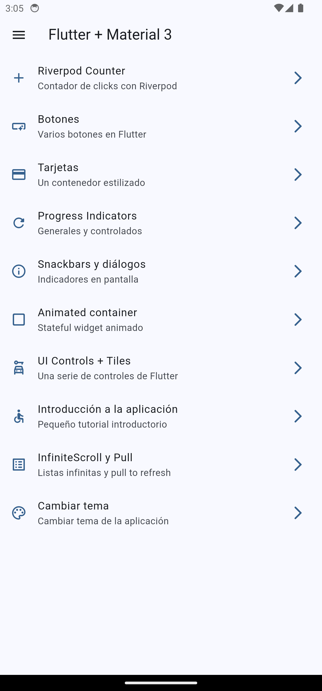
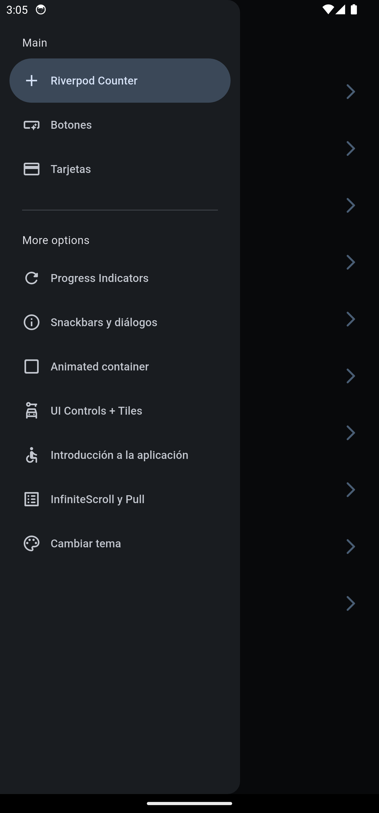
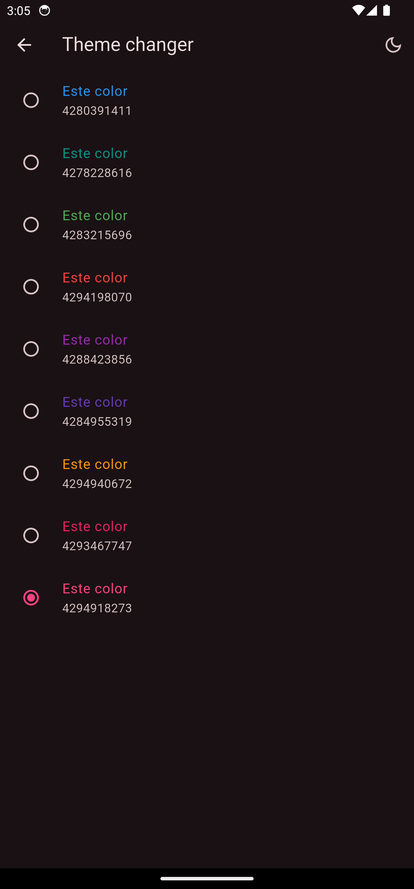
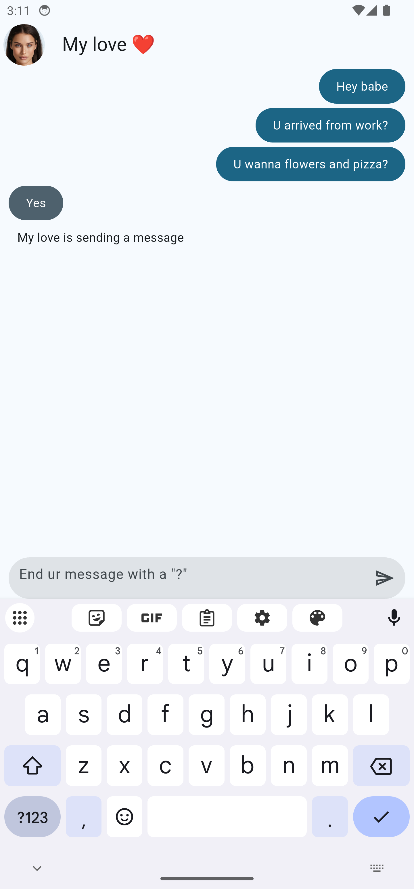
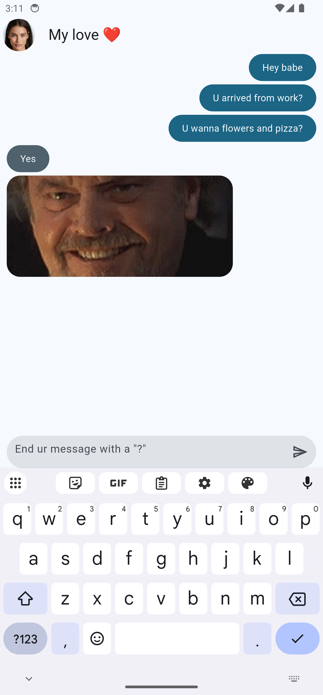
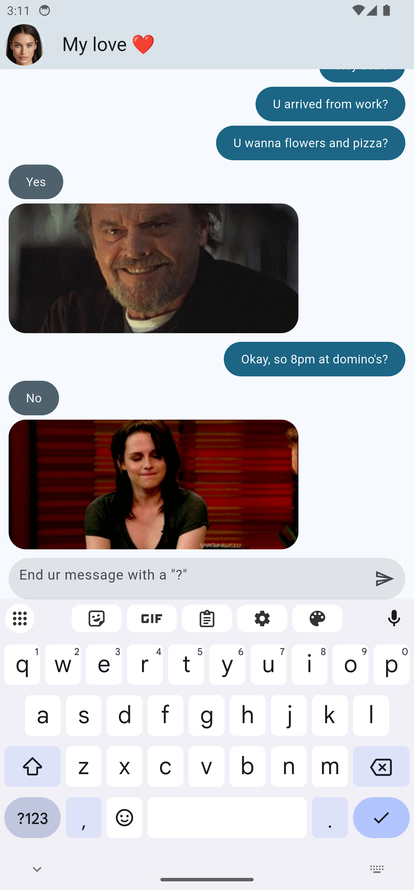
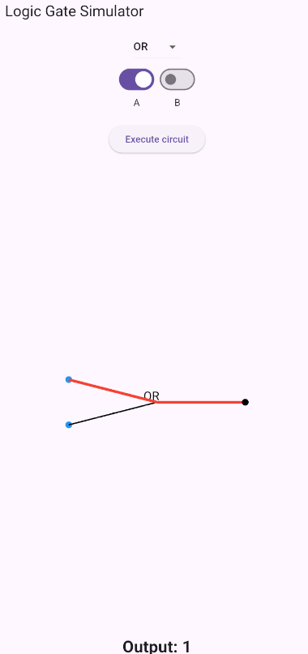
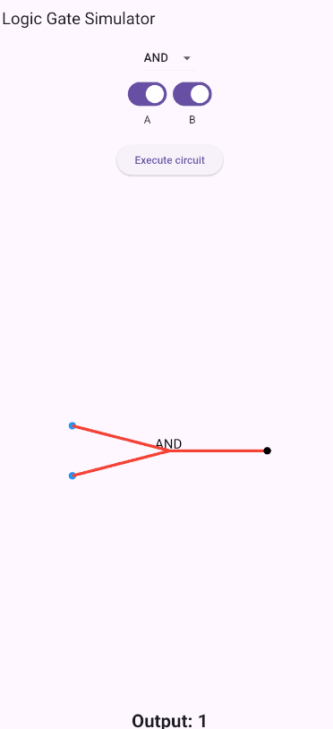

# Flutter Project Suite 🚀  

Este repositorio contiene una colección de aplicaciones desarrolladas en Flutter siguiendo buenas prácticas como Clean Architecture y manejo eficiente del estado con Riverpod.  

## 📌 Proyectos Incluidos  

### 1. **Logic Gates Simulator** 🔲  
Aplicación interactiva que permite construir circuitos lógicos utilizando únicamente la compuerta NAND.  
- 🛠️ **Compuertas disponibles**: AND, NOT, OR, XOR, MUX, DMUX, 4WAYMUX, 8-WAY-OR.  
- 🎞️ **Animación dinámica**: Las señales viajan a través del circuito y producen la salida en tiempo real.  
- 📐 **Diseño flexible**: La interfaz se adapta según la compuerta seleccionada.  

📂 Ubicación del código: `logic_gates_simulator/`  

### 2. **Widgets Showcase** 🏗️  
Aplicación modular en Flutter para explorar widgets reutilizables siguiendo los principios de Clean Code y estado con Riverpod.  
- 📦 **Componentes listos para usar**: Tarjetas, botones, listas dinámicas, inputs, entre otros.  
- ⚡ **Optimización**: Uso eficiente de `Riverpod` para gestión del estado.  
- 📚 **Estructura modular**: Código limpio y desacoplado para facilitar la escalabilidad.  

📂 Ubicación del código: `widgets_app/`  

### 3. **Yes/No App** ❓  
Aplicación simple que consulta una API y devuelve respuestas aleatorias de "Sí" o "No".  
- 🔄 **Integración con API**: Obtiene respuestas dinámicas desde un servicio externo (https://yesno.wtf/#api).  
- 📊 **Manejo de estado eficiente**: Implementación de `FutureProvider` en Riverpod.  
- 🎨 **Diseño minimalista**: UI sencilla e intuitiva.  

📂 Ubicación del código: `yes_no_app/`  

### 4. **TikTok Wrapper** 🎥  
Un wrapper en Flutter que integra una API de videos para simular la experiencia de navegación en TikTok.  
- 📡 **Consumo de API**: Obtiene videos de una fuente externa.  
- 🎞️ **Reproductor optimizado**: Manejo de reproducción eficiente en scroll infinito.  
- 🔧 **Personalizable**: Permite cambiar la fuente de datos según la API configurada.  

📂 Ubicación del código: `tik_tok_wrapper/`  

---  
## 📷 Screenshots
 
 
 
 
 

##📌 Requisitos
- Flutter SDK instalado Flutter 3.27.3 
  - > Tools • Dart 3.6.1 • DevTools 2.40.2 ✅
- Dependencias actualizadas con flutter pub get ✅
- Configuración de API Keys si es necesario (para Movies_app) 🔑

## 🚀 Instalación  

Cada aplicación es independiente, por lo que puedes clonar este repositorio y entrar a la carpeta del proyecto que quieras ejecutar:  

```sh
git clone https://github.com/8ctal/Flutter_mini_projects.git
cd nombre_de_la_app
flutter pub get
flutter run
```
📖 Estructura de Carpetas
```sh
flutter-project-suite/
│── logic_gates_simulator/
│── widgets_app/
│── yes_no_app/
│── tik_tok_wrapper/
└── README.md
```
📢 Contribución
Si quieres mejorar alguna aplicación o añadir nuevas funcionalidades, ¡haz un fork y envía un pull request! 💡

📜 Licencia
Este proyecto está bajo la licencia MIT.

📩 Contacto
Si tienes dudas o sugerencias, contáctame en [camilojaimes04@gmail.com]

🎯 ¡Gracias por revisar este proyecto! 🚀
